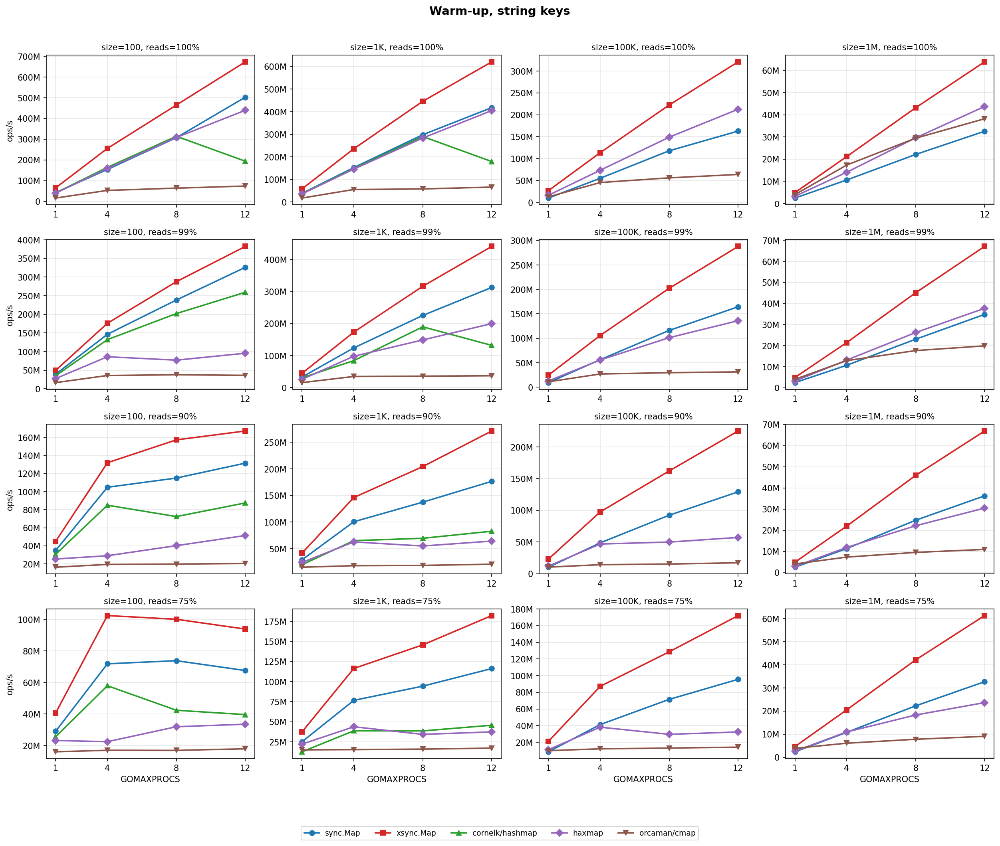
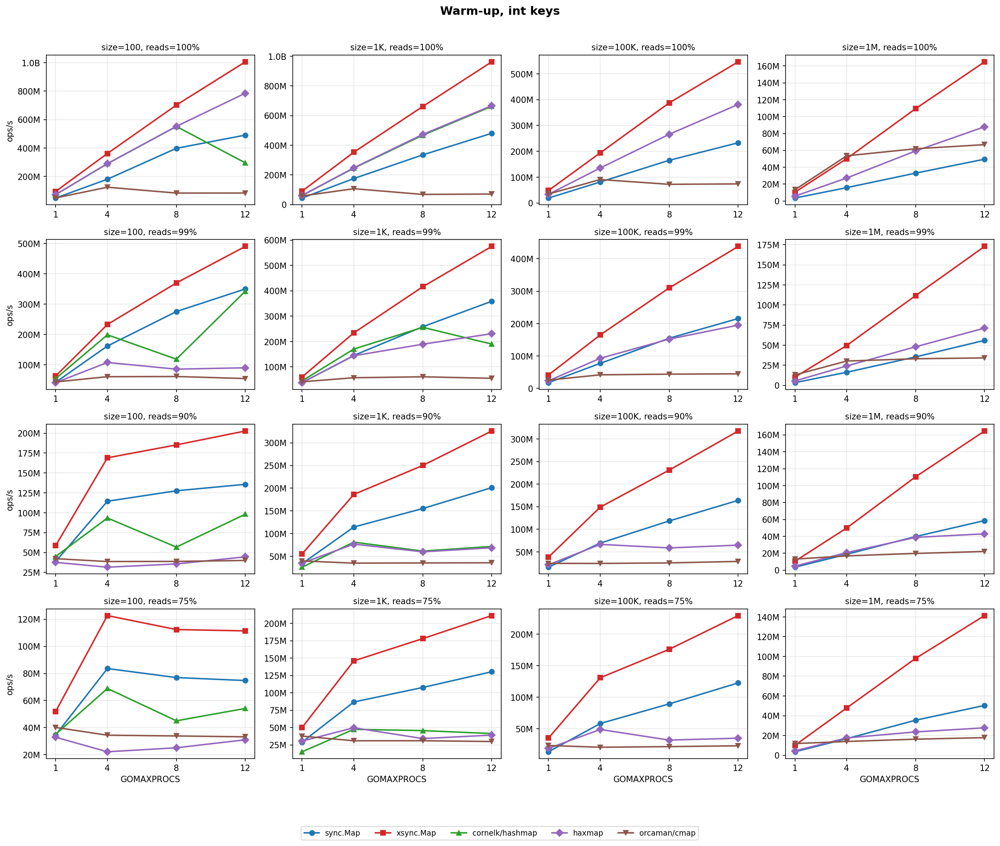
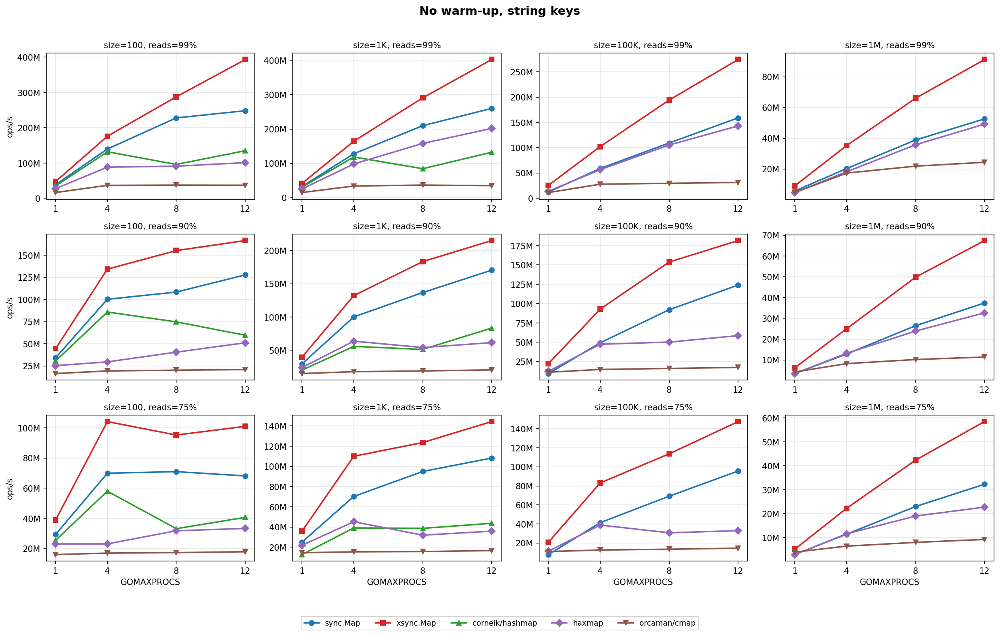
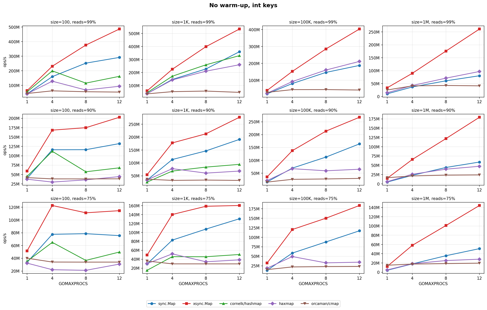
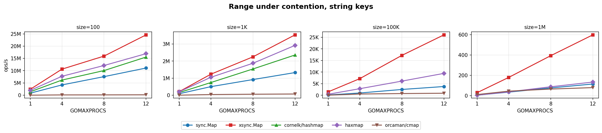
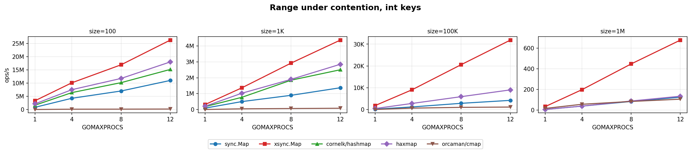

# go-concurrent-map-bench

Benchmarks for concurrent hash map implementations in Go.

**Disclaimer:** I'm the author of [xsync](https://github.com/puzpuzpuz/xsync), one of the libraries benchmarked here. I did my best to keep this benchmark neutral and fair to all implementations. If you spot any issues or have suggestions for improvements, please open an issue.

## Participants

### [sync.Map](https://pkg.go.dev/sync#Map) (stdlib)

Since Go 1.24, `sync.Map` is backed by a `HashTrieMap` — a concurrent hash trie with 16-way branching at each level. Reads are lock-free via atomic pointer traversal through the trie nodes. Writes acquire a per-node mutex, affecting only a small subtree. The trie grows lazily as entries are inserted.

### [xsync.Map](https://github.com/puzpuzpuz/xsync)

A hash table organized into cache-line-sized buckets, each holding up to 5 entries. Each bucket has its own mutex for writes, while reads are fully lock-free using atomic loads. Lookups use SWAR (SIMD Within A Register) techniques on per-entry metadata bytes for fast key filtering. Table resizing is cooperative: all goroutines help migrate buckets during growth.

### [cornelk/hashmap](https://github.com/cornelk/hashmap)

A lock-free hash map combining a hash table index with sorted linked lists for collision resolution. All mutations (insert, update, delete) use atomic CAS operations. A background goroutine triggers table resize when the fill factor exceeds 50%. The sorted list ordering enables efficient concurrent traversal.

### [alphadose/haxmap](https://github.com/alphadose/haxmap)

Based on Harris's lock-free linked list algorithm with a hash table index layer. Uses xxHash for hashing and atomic CAS for all mutations. Deletions are lazy (nodes are logically marked before physical removal). Auto-resizes when the load factor exceeds 50%.

### [orcaman/concurrent-map](https://github.com/orcaman/concurrent-map)

A straightforward sharded design with 32 fixed shards. Each shard is a regular Go map protected by a `sync.RWMutex`. Keys are assigned to shards using FNV-32 hashing. The fixed shard count makes it simple and predictable, but limits scalability under high parallelism.

## Workloads

Each benchmark uses permille-based random operation selection:

- **100% reads** — all loads (warm-up only)
- **99% reads** — 99% loads, 0.5% stores, 0.5% deletes
- **90% reads** — 90% loads, 5% stores, 5% deletes
- **75% reads** — 75% loads, 12.5% stores, 12.5% deletes
- **Range under contention** — all goroutines iterate the map while a single background goroutine continuously updates random keys

## Key Types

- `string` keys (with a long prefix to stress hashing)
- `int` keys

## Map Sizes

| Size | Approx Footprint | Target |
|---|---|---|
| 100 | ~15 KB | Fits in L1 |
| 1,000 | ~150 KB | Fits in L2 |
| 100,000 | ~15 MB | Fits in L3 |
| 1,000,000 | ~150 MB | Spills to RAM |

## Warm-up Variants

- **WarmUp** — map is pre-populated before the benchmark starts (all workloads)
- **NoWarmUp** — map starts empty (mixed workloads only, 100% reads is skipped)

## How to Run

```bash
# Run all benchmarks
go test -bench . -benchtime 5s

# Run a specific library
go test -bench BenchmarkXsyncMapOf -benchtime 5s

# Run only string key benchmarks
go test -bench 'StringKeys' -benchtime 5s

# Run only warm-up benchmarks at size=1000
go test -bench 'WarmUp.*size=1000' -benchtime 5s
```

## Environment

The benchmark results in this repository were collected on the following setup:

- **CPU:** AMD Ryzen 9 7900 12-Core Processor (24 threads)
- **OS:** Linux (amd64)
- **Go:** go1.26.0
- **GOMAXPROCS:** 1, 4, 8, 12

Each benchmark was run with `-benchtime 3s -count 3` and results were collected for each GOMAXPROCS value separately.

## Results

Each plot shows ops/s (Y axis) vs GOMAXPROCS (X axis) for all libraries. For read/write workloads, rows correspond to read percentages and columns to map sizes. Range plots have a single row with columns for map sizes.

`cornelk/hashmap` was benchmarked at sizes 100 and 1,000 only due to significant performance degradation at larger sizes.

### Warm-up, string keys



### Warm-up, int keys



### No warm-up, string keys



### No warm-up, int keys



### Range under contention, string keys



### Range under contention, int keys



## Allocation Rates

All libraries report **0 allocs/op** across every read/write benchmark. The tables below show **B/op** (bytes allocated per operation, amortized) for the WarmUp variant. Values are consistent across map sizes and GOMAXPROCS values. Range benchmarks are excluded as they allocate due to iteration overhead (closures, internal snapshots, channel buffers).

**String keys:**

| Library | 100% reads | 99% reads | 90% reads | 75% reads |
|---|---|---|---|---|
| `sync.Map` | 0 | 0 | 3 | 9 |
| `xsync.Map` | 0 | 0 | 1 | 2 |
| `cornelk/hashmap`\* | 0 | 0 | 1 | 4 |
| `alphadose/haxmap` | 0 | 0 | 1 | 3 |
| `orcaman/concurrent-map` | 0 | 0 | 0 | 0 |

**Int keys:**

| Library | 100% reads | 99% reads | 90% reads | 75% reads |
|---|---|---|---|---|
| `sync.Map` | 0 | 0 | 3 | 8 |
| `xsync.Map` | 0 | 0 | 0 | 2 |
| `cornelk/hashmap`\* | 0 | 0 | 1 | 4 |
| `alphadose/haxmap` | 0 | 0 | 1 | 3 |
| `orcaman/concurrent-map` | 0 | 0 | 0 | 0 |

\* `cornelk/hashmap` was benchmarked at sizes 100 and 1,000 only due to significant performance degradation at larger sizes.

`orcaman/concurrent-map` shows zero allocations because its shards use regular Go maps, which don't allocate when overwriting existing keys. Other libraries allocate small amounts during writes due to their internal data structure overhead. `sync.Map` has the highest per-write allocation cost, while `xsync.Map` has the lowest among the non-sharded implementations.

### Summary

| Library | Strengths | Weaknesses |
|---|---|---|
| `sync.Map` | Stdlib, no dependencies; excellent read scaling; solid all-round since Go 1.24 | Highest per-write allocation cost; slower than xsync.Map under all workloads |
| `xsync.Map` | Fastest in nearly every scenario; best read, write, and iteration scaling; lowest allocations among non-sharded designs | External dependency; writes allocate |
| `cornelk/hashmap` | Competitive at small sizes with read-heavy workloads | Significant performance degradation at sizes ≥100K with writes; limited to small maps in practice |
| `alphadose/haxmap` | Good read-only performance at small sizes; lock-free design | Poor write scaling under contention; falls behind at higher parallelism |
| `orcaman/concurrent-map` | Zero allocations (read/write); simple and predictable; decent single-threaded performance | Fixed 32 shards limit scalability; worst read-only throughput due to mutex overhead; write scaling plateaus early; slowest iteration due to channel-based API |
